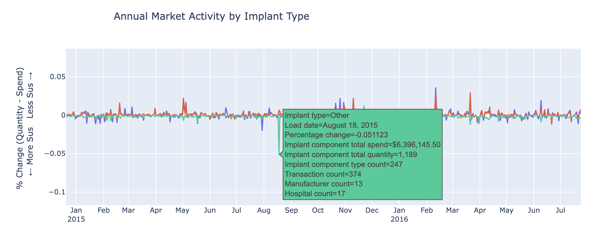

# **Fragmented Arthroplasty Implant Market Viz**

The economics of arthroplasty surgical implant purchases by U.S. hospitals in relation to the high markups imposed by implant manufacturers remains an understudied research area. The arthosplasty implant market is nortoriously opaque with limited pricing transparency, making it difficult for hospitals to know if they're getting a fair deal. Furthermore, surgical implants often have high markups -- sometimes 300-600% over manufacturing costs. This is due to large medical device companies maintaining [20-30% profit margins](https://www.healthcarevaluehub.org/advocate-resources/publications/medical-devices-worrying-parallels-our-nations-prescription-drug-concerns), with some products commanding even higher margins. The pricing of implants is often based on what the market and reimbursement system will [tolerate](https://starfishmedical.com/resource/margin-matters/), rather than production costs.

Here, I wanted to explore the behavioral economics of the arthroplasty implant market from the perspective of an U.S. hospital. This data-driven analysis of hospitals' (bulk) implant purchases reveals alarming markup patterns in implant component transactions -- data originally collected by the [Economic Cycle Research Institute (ECRI)](https://www.businesscycle.com/).

